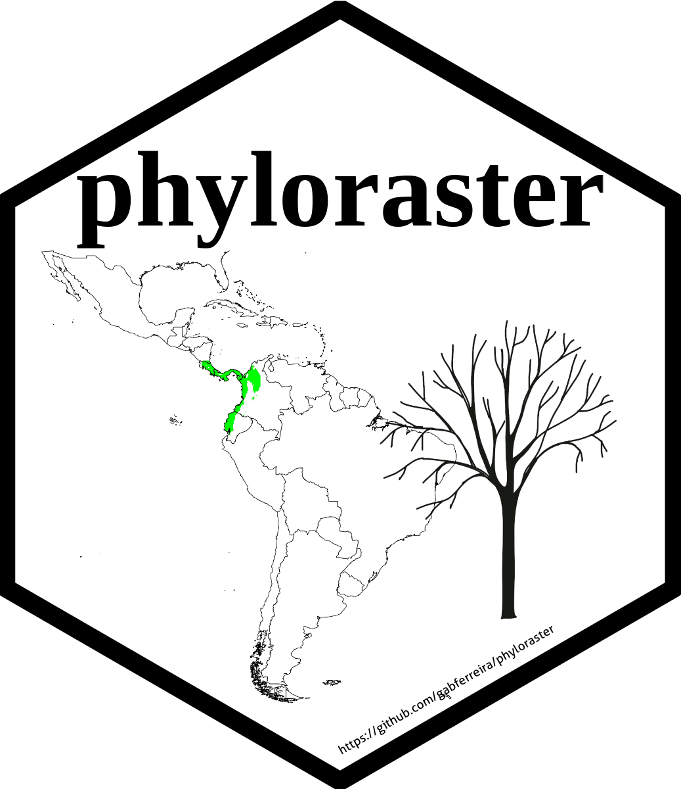

<!-- badges: start -->

[](https://cran.r-project.org/package=phyloraster) [](https://github.com/gabferreira/phyloraster/actions/workflows/R-CMD-check.yaml) [](https://app.codecov.io/gh/gabferreira/phyloraster) [](https://cran.r-project.org/package=phyloraster) [](https://cran.r-project.org/package=phyloraster)

<!-- badges: end -->

# phyloraster <a href="https://gabferreira.github.io/phyloraster/"></a>

<br>

[`phyloraster`](https://github.com/gabferreira/phyloraster) is an R package to calculate measures of endemism and evolutionary diversity using rasters of presence-absence as input, allowing to join the results derived from species distribution models (SDMs) with phylogenetic information.

<br>

### Installation

The CRAN version of the package can be installed using:

```         
install.packages("phyloraster") 
```

The development version of `phyloraster` can be downloaded from [GitHub](https://github.com/gabferreira/phyloraster) using the following code:

```         
devtools::install_github("gabferreira/phyloraster")
```

<br>

### Example usage

Example usage and information about the package can be found at the [package's webpage](https://gabferreira.github.io/phyloraster/) or in the vignette `vignette("phyloraster-vignette")`

<br>

### Citation

Please cite both the package and the article describing the methods in your publications:. Here is an example:

-  Article recently published in [`Ecography`](https://doi.org/10.1111/ecog.06902):
Alves-Ferreira G, Mota FMM, Talora DC, Oliveira, C, Solé, MK, Heming NM (2024). phyloraster: an R package to calculate measures of endemism and evolutionary diversity for rasters. Ecography. doi: 10.1111/ecog.06902.

-  Package published in [`CRAN`](https://CRAN.R-project.org/package=phyloraster):
Alves-Ferreira G, Heming NM, Mota FMM. (2024). phyloraster: Evolutionary Diversity Metrics for Raster Data. R package version 2.0. doi: 10.32614/CRAN.package.phyloraster

For more information:

```         
citation("phyloraster")
```

<br>

### Issues

If you have any question or find any bug, let us know through the topic [Issues](https://github.com/gabferreira/phyloraster/issues).

<br>
