# Introduction to the phyloraster package and its functionalities

- [Introduction](#intro)
- [Installation](#install)
- [Data processing](#data)
- [Analysis](#analysis)
- [Null Models](#null)
- [CANAPE](#CANAPE)
- [Citation](#citation)
- [References](#references)

## Introduction

[`phyloraster`](https://github.com/gabferreira/phyloraster) is an R
package to calculate measures of endemism and evolutionary diversity
using rasters of presence-absence as input, allowing to join the results
derived from species distribution models (SDMs) with phylogenetic
information. A lot of packages such as `phyloregion` (Daru et al.,
2020), `picante` (Kembel et al., 2010) and `pez` (Pearse et al. 2015)
can be used to calculate patterns of endemism and evolutionary
diversity. However, most of these packages use matrices that can be
computationally expensive if the user is working with global or local
data with high resolution. `phyloraster` brings an alternative to these
packages by providing functions that calculate diversity and endemism
metrics for each raster cell, reducing the amount of RAM required for
data processing. The functions are focused on the steps of
pre-processing, processing and post-processing of macroecological and
phylogenetic data.

The pre-processing step offers basic functions for preparing the data
before running the analyses. The processing step brings together
functions to calculate Faith’s phylogenetic diversity, phylogenetic
endemism, weighted endemism and evolutionary distinctiveness. This step
also provides functions to calculate standardized effect size for each
metric through different methods of spatial and phylogenetic
randomization, aiming to control for richness effects. The user can
applying these methods of randomization to test hypotheses about the
community structure when richness patterns are correlated with endemism
and evolutionary patterns (Kembel et al. 2010). The post processing
stage includes functions to calculate the delta of metrics between
different times (e.g. present and future). We have shown that the
package has a slightly longer computation time than comparable packages,
but takes up a considerably smaller portion of RAM memory, which will
allow users to work with high-resolution datasets from local to global
scales. This enhances the application of the package by enabling users
to work with large datasets on computers with less RAM available. In
this vignette, we demonstrate the use of the functions of the
`phyloraster` package in detail.

## Installation

The CRAN version of the package can be installed using:

``` r
# install.packages("phyloraster")
```

The development version of `phyloraster` can be downloaded from
[GitHub](https://github.com/gabferreira/phyloraster) using the following
code:

``` r
devtools::install_github("gabferreira/phyloraster")
```

If you have any questions, let us know through the topic
[“Issues”](https://github.com/gabferreira/phyloraster/issues).

`phyloraster` uses some R packages as dependencies such as `terra`
(version \>= 1.6) (Hijmans, 2022), `ape` (version \>= 5.6) (Paradis &
Schliep, 2019), and `phylobase` (version \>= 0.810) (Hackathon et
al. 2020). Once installed, packages can be loaded into R using
[`library()`](https://rdrr.io/r/base/library.html):

``` r
library(phyloraster)
library(terra)
library(ape)
library(phylobase)
```

## Data processing

In the step of pre-processing, we offer support to manipulate matrices,
shapefiles, rasters, and phylogenetic trees. In the processing step, we
provide functions to calculate Faith’s phylogenetic diversity (Faith,
1992), phylogenetic endemism (Rosauer et al., 2009), evolutionary
distinctiveness (Isaac et al., 2007), and weighted endemism (Williams et
al., 1994).

- **Dataset**

The package contains one dataset that allows visualizing the structure
expected to matrices, rasters, shapefiles and phylogenetic trees and can
be accessed using the function
[`load.data.rosauer()`](https://gabferreira.github.io/phyloraster/reference/load.data.rosauer.md).
This dataset contains a `data.frame` with presence records for 33
Australian tree frogs with coordinates for each site (Rosauer 2017) and
a phylogenetic tree for these species (Rosauer 2017). This raw dataset
can be accessed
[here](https://github.com/DanRosauer/phylospatial/tree/master/PhyloEndemism_in_R/Tree%20Frog%20Data).
The function also provide a binary raster of presence absence and a
shapefile with the range of 27 species following IUCN spatial data.

``` r
data <- load.data.rosauer()
head(data$presab[,1:7])
#>   Longitude Latitude Litoria_revelata Litoria_rothii Litoria_longirostris
#> 1  144.0657  -14.894                0              1                    0
#> 2  144.0657  -15.194                0              1                    0
#> 3  144.0657  -16.694                0              1                    0
#> 4  144.0657  -15.494                0              1                    0
#> 5  144.0657  -16.294                0              1                    0
#> 6  144.0657  -16.594                0              1                    0
#>   Litoria_dorsalis Litoria_rubella
#> 1                0               1
#> 2                0               1
#> 3                0               1
#> 4                0               1
#> 5                0               1
#> 6                0               1
```

``` r
plot(data$raster[[1]], cex = 0.65)
```

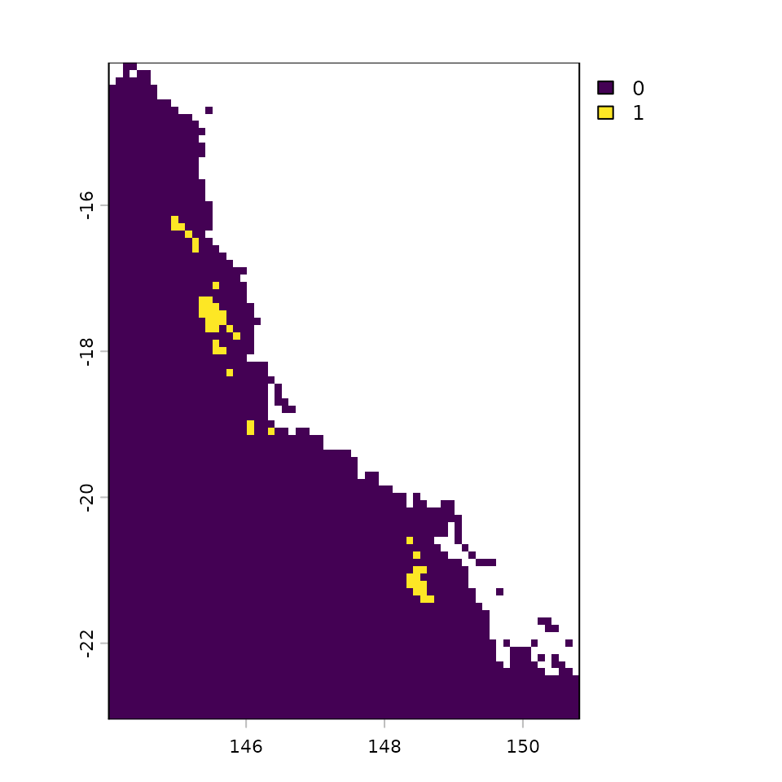

``` r
data$tree
#> 
#> Phylogenetic tree with 33 tips and 26 internal nodes.
#> 
#> Tip labels:
#>   Litoria_revelata, Litoria_rothii, Litoria_longirostris, Litoria_dorsalis, Litoria_rubella, Litoria_nigrofrenata, ...
#> 
#> Rooted; includes branch length(s).
```

``` r
plot(data$tree, cex = 0.65)
```


- **Function** `df2rast`

The function `df2rast` converts traditional communities matrices
(i.e. species in columns and sites in rows, with coordinates in the two
first columns) into binary distribution rasters (presence and absence).

``` r
data <- load.data.rosauer()
r <- df2rast(x = data$presab, 
             CRS = "+proj=longlat +datum=WGS84 +ellps=WGS84 +towgs84=0,0,0")
class(r)
#> [1] "SpatRaster"
#> attr(,"package")
#> [1] "terra"
```

``` r
plot(r)
```

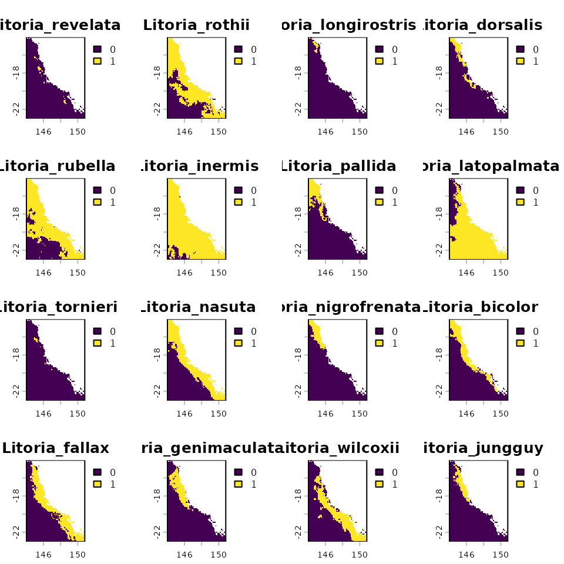

- **Function** `shp2rast`

The `shp2rast` function transform a shapefile to a raster stack with the
same extent. This function allows to work, for example, with the shapes
of species distribution provided by the [International Union for the
Conservation of Nature’s Spatial
Database](https://www.iucnredlist.org/resources/spatial-data-download).
We provide a set of shapefiles for 27 species of Australian tree frogs.
You can visualize this data through the following code:

``` r
shp <- terra::vect(system.file("extdata", "shps_iucn_spps_rosauer.shp", 
                               package = "phyloraster"))
```

``` r
colors <- rainbow(length(unique(shp$BINOMIAL)),
                  alpha = 0.5)
position <- match(shp$BINOMIAL,
                  unique(shp$BINOMIAL))
colors <- colors[position]
plot(shp, col = colors, lty = 0,
     main = "Spatial polygons")
library(maps)
maps::map(add = TRUE)
```

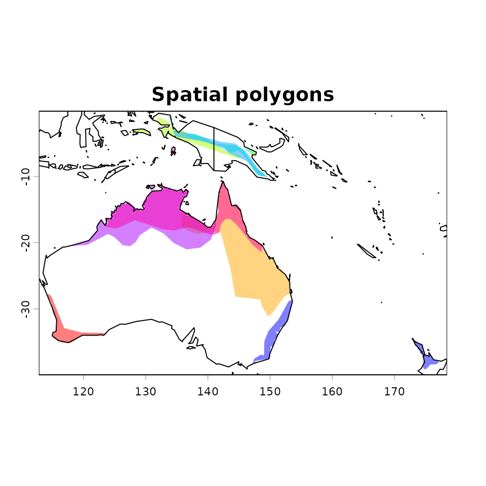

``` r
r2 <- shp2rast(shp, sps.col = "BINOMIAL", ymask = FALSE, background = 0, 
               resolution = 0.5)
r2
#> class       : SpatRaster 
#> size        : 77, 126, 9  (nrow, ncol, nlyr)
#> resolution  : 0.5008004, 0.4970178  (x, y)
#> extent      : 114.099, 177.1998, -39.17965, -0.9092805  (xmin, xmax, ymin, ymax)
#> coord. ref. : lon/lat WGS 84 (CRS84) (OGC:CRS84) 
#> source(s)   : memory
#> names       : Litor~ensis, Litor~ttata, Litor~ensis, Litor~malin, Litor~giana, Litor~kiana, ... 
#> min values  :           0,           0,           0,           0,           0,           0, ... 
#> max values  :           1,           1,           1,           1,           1,           1, ...
plot(r2[[9]])
```

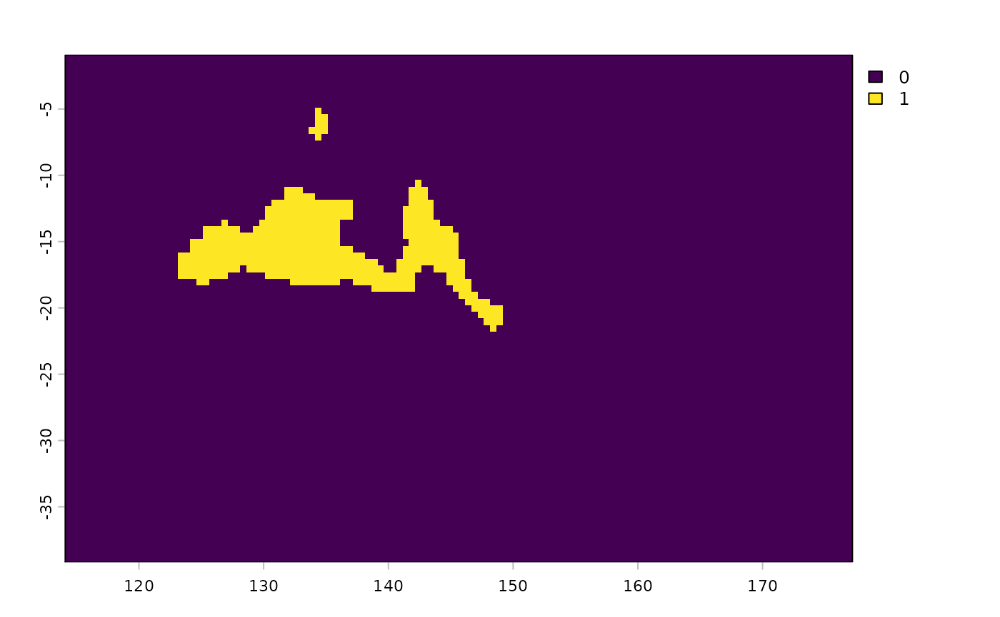

You can also masking the shapefile using another shapefile, as follows:

``` r
library(terra)

shp <- terra::vect(system.file("extdata", "shps_iucn_spps_rosauer.shp",
                               package="phyloraster"))

# create a polygon to use as mask with an extent
e <- terra::ext(113, 123, -43.64, -33.90)
p <- terra::as.polygons(e, crs="")
# cut by the total extension of the polygons
coun.crop <- terra::crop(p, 
                         terra::ext(shp)) 
coun.rast <- terra::rasterize(coun.crop,
                              terra::rast(terra::ext(shp), resolution = 0.5))

# rasterizing with the mask of the polygon
shp.t <- shp2rast(shp, y = coun.rast, sps.col = "BINOMIAL", ymask = TRUE)
plot(shp.t[[1]])
```

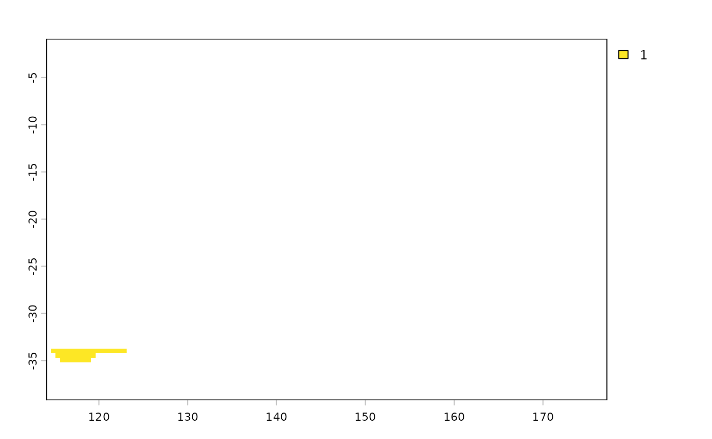

- **Function** `phylo.pres`

To calculate evolutionary measurements it is extremely important that
the raster with species distributions and the tree have the species
names in the same order. We can verify this premise using a simple
logical test like this.

``` r
data <- load.data.rosauer()
names(data$raster) == data$tree$tip.label
#>  [1]  TRUE  TRUE  TRUE  TRUE  TRUE FALSE FALSE FALSE FALSE FALSE FALSE  TRUE
#> [13]  TRUE  TRUE FALSE FALSE FALSE  TRUE FALSE FALSE FALSE  TRUE  TRUE FALSE
#> [25] FALSE  TRUE  TRUE  TRUE  TRUE  TRUE  TRUE  TRUE  TRUE
```

The function `phylo.pres` reorder the raster stack according to
phylogenetic tree order, extract a subtree containing only species
present in the raster stack and get the branch length for each species.

``` r
ras <- terra::rast(system.file("extdata", "rast.presab.tif", 
                               package = "phyloraster"))
tree <- ape::read.tree(system.file("extdata", "tree.nex", 
                                   package = "phyloraster"))
dataprep <- phylo.pres(x = ras, tree = tree)
```

Now, the raster stack and the tip label of the tree are in the same
order!

``` r
names(dataprep$x) == tree$tip.label
#>  [1] TRUE TRUE TRUE TRUE TRUE TRUE TRUE TRUE TRUE TRUE TRUE TRUE TRUE TRUE TRUE
#> [16] TRUE TRUE TRUE TRUE TRUE TRUE TRUE TRUE TRUE TRUE TRUE TRUE TRUE TRUE TRUE
#> [31] TRUE TRUE TRUE
```

The user also has the option to compute branch length and descendant
number using the full supplied tree or the tree subsetted by the species
present in the raster. Notice the implications of using the full or the
subsetted tree. Consider, for instance, a scenario where a clade
comprises four species (A, B, C and D - Figure 1a), and the particular
area of study involves two of these species (A and B, in blue- Figure
1). Furthermore, let’s assume that species A and B share a branch,
denoted as D (in red- Figure 1). Using the full phylogenetic tree will
estimate the whole length of branches for these two species, including
the branch shared between them (D), that connects them with the ancestor
shared with the species absent from that specific region (Figure 1b). On
the other hand, when using the subsetted tree (Figure 1c), branch D will
be disregarded and only the terminal branches will be used to calculate
branch length, so that the calculated branch lengths of the species A
and B will be shorter (Figure 1c).

``` r
ras <- terra::rast(system.file("extdata", "rast.presab.tif", 
                               package = "phyloraster"))
tree <- ape::read.tree(system.file("extdata", "tree.nex", 
                                   package = "phyloraster"))

# Using the full tree
dataprep_full <- phylo.pres(x = ras, tree = tree, full_tree_metr = TRUE)

# Using the prunned tree
dataprep_sub <- phylo.pres(x = ras, tree = tree, full_tree_metr = FALSE) 
```

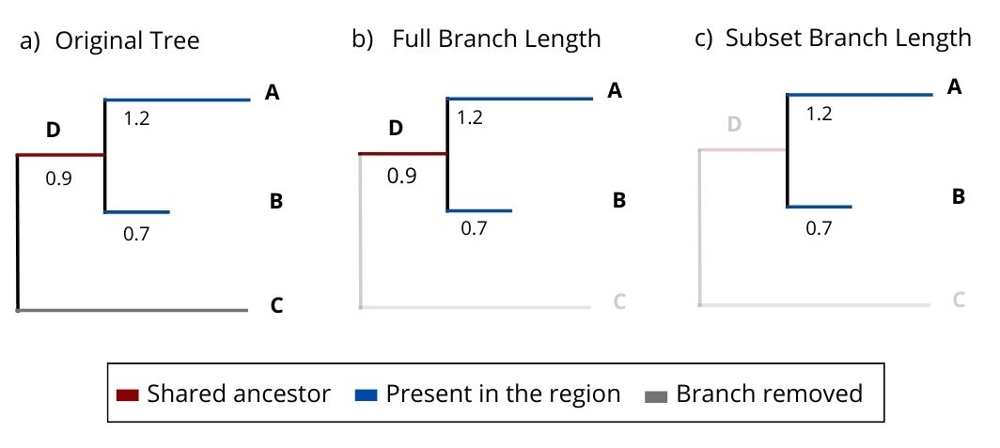

Figure 1. Phylogenetic tree for tree frogs denoting the implications of
using the full or the subsetted tree in the phylo.pres function. Figure
a) demonstrates the full phylogenetic tree for some tree frog species.
In figure b), we have the full tree considering species A and B that are
present in the region (blue), as well as the common ancestor between the
two species (red). In figure c) we only have the species present in the
region.

## Analysis

Great!! Now, we are already able to calculate the measures of species
richness, endemism and evolutionary diversity.

- **Species richness**

Our package allows you to calculate species richness using the `rast.sr`
function.

``` r
ras <- terra::rast(system.file("extdata", "rast.presab.tif", 
                               package = "phyloraster"))
sr <- rast.sr(x = ras)
sr
#> class       : SpatRaster 
#> size        : 90, 68, 1  (nrow, ncol, nlyr)
#> resolution  : 0.1, 0.1  (x, y)
#> extent      : 144.0157, 150.8157, -23.044, -14.044  (xmin, xmax, ymin, ymax)
#> coord. ref. : lon/lat WGS 84 (EPSG:4326) 
#> source(s)   : memory
#> name        : SR 
#> min value   :  2 
#> max value   : 29
```

``` r
plot(sr, main = "Species richness")
```

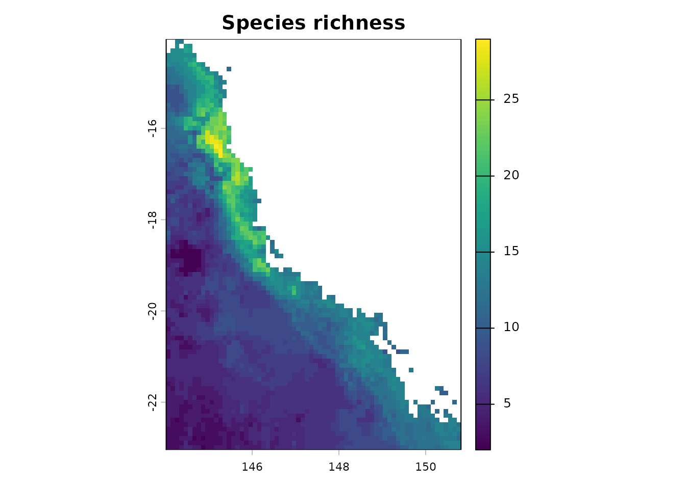

- **Endemism measurements**

The `phyloraster` package implements functions for calculating spatial
patterns of endemism based on the weighted endemism method (WE; Williams
et al. 1994, Crisp et al. 2001) through the function `rast.we`. The
function returns a raster with the values of weighted endemism by each
pixel. Endemism values range from 0 to 1.

``` r
ras <- terra::rast(system.file("extdata", "rast.presab.tif", 
                               package = "phyloraster"))
wer <- rast.we(x = ras)
```

By using the R plot function from `terra` package it is possible to
visualize the regions where species with restricted range are
distributed.

``` r
wer$WE
#> class       : SpatRaster 
#> size        : 90, 68, 1  (nrow, ncol, nlyr)
#> resolution  : 0.1, 0.1  (x, y)
#> extent      : 144.0157, 150.8157, -23.044, -14.044  (xmin, xmax, ymin, ymax)
#> coord. ref. : lon/lat WGS 84 (EPSG:4326) 
#> source(s)   : memory
#> name        :           WE 
#> min value   : 0.0007231441 
#> max value   : 0.2989257007
plot(wer$WE, main ="Weigthed Endemism")
```

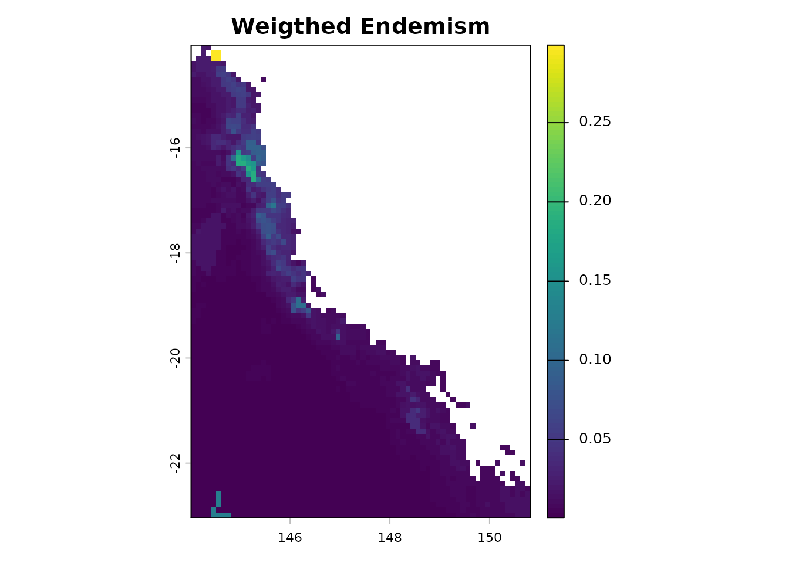

- **Evolutionary measurements**

The first evolutionary measure is Faith’s phylogenetic diversity (PD,
Faith 1994), which is calculated as the sum of the branch length for all
species occurring in a given region (Faith 1994).

``` r
ras <- terra::rast(system.file("extdata", "rast.presab.tif", 
                               package = "phyloraster"))
tree <- ape::read.tree(system.file("extdata", "tree.nex", 
                                   package = "phyloraster"))
dataprep <- phylo.pres(x = ras, tree = tree, full_tree_metr = TRUE)

pdr <- rast.pd(x = dataprep$x, dataprep$tree)
```

``` r
plot(pdr$PD, main = "Phylogenetic diversity")
```

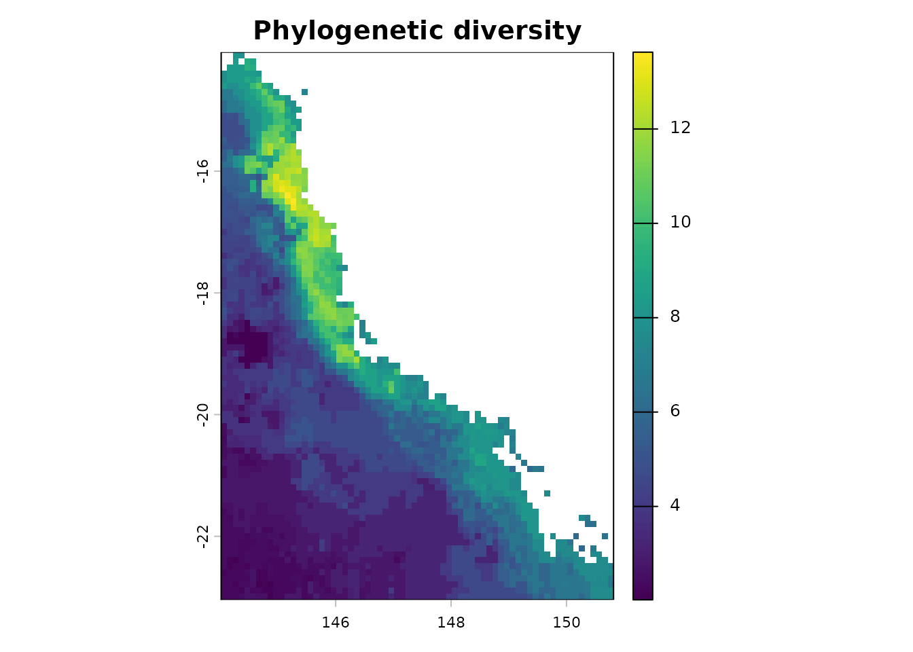

The second measure is phylogenetic endemism (PE, Rosauer et al. 2009),
which calculates the degree to which PD are restricted to a specific
region (Rosauer et al. 2009). The function `rast.pe` returns a raster
layer containing PE the region of interest.

``` r
ras <- terra::rast(system.file("extdata", "rast.presab.tif", 
                               package = "phyloraster"))
tree <- ape::read.tree(system.file("extdata", "tree.nex", 
                                   package = "phyloraster"))
dataprep <- phylo.pres(x = ras, tree = tree, full_tree_metr = TRUE)

per <- rast.pe(x = dataprep$x, dataprep$tree)
per
#> class       : SpatRaster 
#> size        : 90, 68, 1  (nrow, ncol, nlyr)
#> resolution  : 0.1, 0.1  (x, y)
#> extent      : 144.0157, 150.8157, -23.044, -14.044  (xmin, xmax, ymin, ymax)
#> coord. ref. : lon/lat WGS 84 (EPSG:4326) 
#> source(s)   : memory
#> name        :           PE 
#> min value   : 0.0002224064 
#> max value   : 0.1756404428
```

The result can be visualized using the R `plot` function from the
`terra` package.

``` r
plot(per$PE, main = "Phylogenetic Endemism")
```

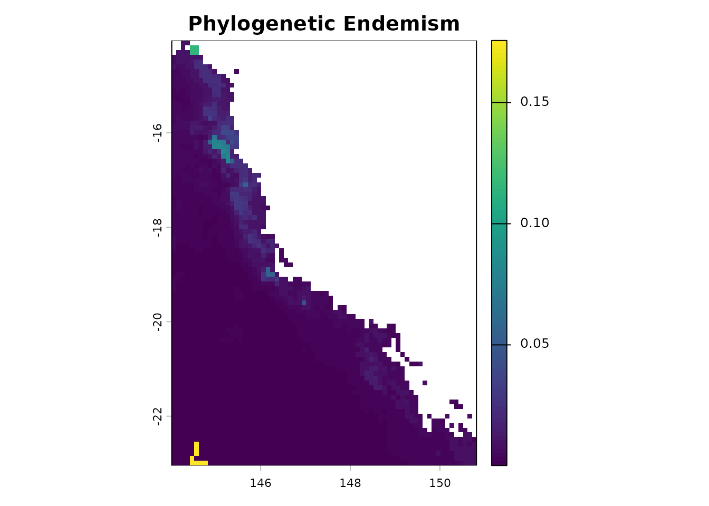

The third metric is evolutionary distinctiveness (ED; Isaac et al. 2007)
or ‘fair proportion’ (Redding et al. 2014), which is calculated dividing
the total phylogenetic diversity of a clade among its members (Isaac et
al. 2007). Our package returns a map with the mean value of ED for each
cell, that is calculated based on the ED for species presents in each
raster cell. The function `rast.ed` calculates this metric and returns a
raster layer containing ED the region of interest.

``` r
x <- terra::rast(system.file("extdata", "rast.presab.tif", 
                             package="phyloraster"))
# phylogenetic tree
tree <- ape::read.tree(system.file("extdata", "tree.nex", 
                                   package="phyloraster"))
dataprep <- phylo.pres(x = ras, tree = tree, full_tree_metr = TRUE)

ed <- rast.ed(dataprep$x, dataprep$tree)
ed
#> class       : SpatRaster 
#> size        : 90, 68, 1  (nrow, ncol, nlyr)
#> resolution  : 0.1, 0.1  (x, y)
#> extent      : 144.0157, 150.8157, -23.044, -14.044  (xmin, xmax, ymin, ymax)
#> coord. ref. : lon/lat WGS 84 (EPSG:4326) 
#> source(s)   : memory
#> name        :        ED 
#> min value   : 0.3060478 
#> max value   : 0.9842739
```

The result can be visualized using the R `plot` function from the
`terra` package.

``` r
terra::plot(ed, main = "Evolutionary Distinctiveness")
```

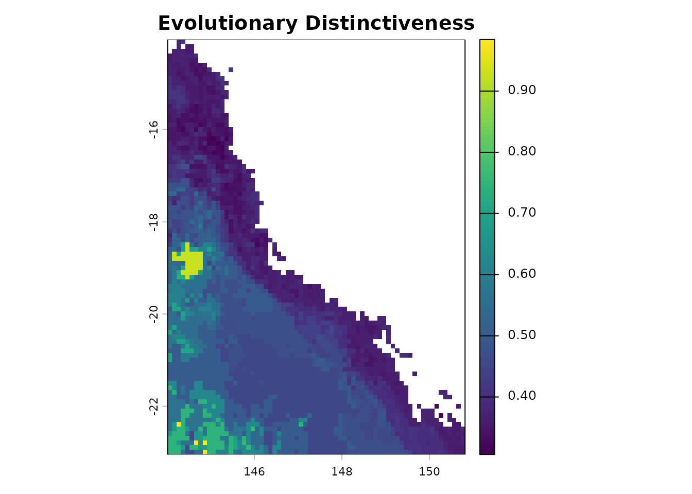

We also added a new function to calculates the Evolutionary
distinctiveness for each species separately. The function will divide
the total phylogenetic diversity of a clade among its members (Isaac et
al., 2007).

``` r
tree <- ape::read.tree(system.file("extdata", "tree.nex", 
                                   package="phyloraster"))

ed <- phyloraster::species.ed(tree)
head(ed)
#>                             ED
#> Litoria_revelata     0.6440047
#> Litoria_rothii       0.6440037
#> Litoria_longirostris 0.5470682
#> Litoria_dorsalis     0.5470682
#> Litoria_rubella      0.6440037
#> Litoria_nigrofrenata 0.5563398
```

- **Function** `delta.grid`

The package also brings the function `delta.grid` that allows you to
calculate the difference between rasterized diversity metrics between
two different times. This function would allow assessing how species
richness varies between different times, which could be useful in a
climate change scenario. For example, imagine that we currently have 33
tree frog species of the subfamily Pelodryadinae occurring in Australia.
In the map below we can visualize the spatial pattern of species
richness.

``` r
# load the data
x <- terra::rast(system.file("extdata", "rast.presab.tif", 
                             package="phyloraster"))
# richness
riq.pres <- rast.sr(x)
plot(riq.pres)
```

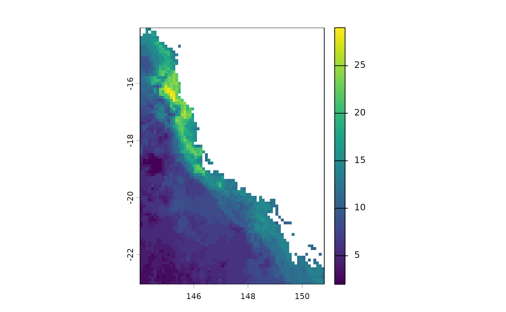

Now imagine that as climate change progresses, 16 relatively more
vulnerable species are heavily affected and become locally extinct.

``` r
# load the data
x <- terra::rast(system.file("extdata", "rast.presab.tif", 
                             package="phyloraster"))
# richness future
riq.fut <- rast.sr(x[[c(1:15)]]) # imagine we lost some species in the future
terra::plot(riq.fut)
```

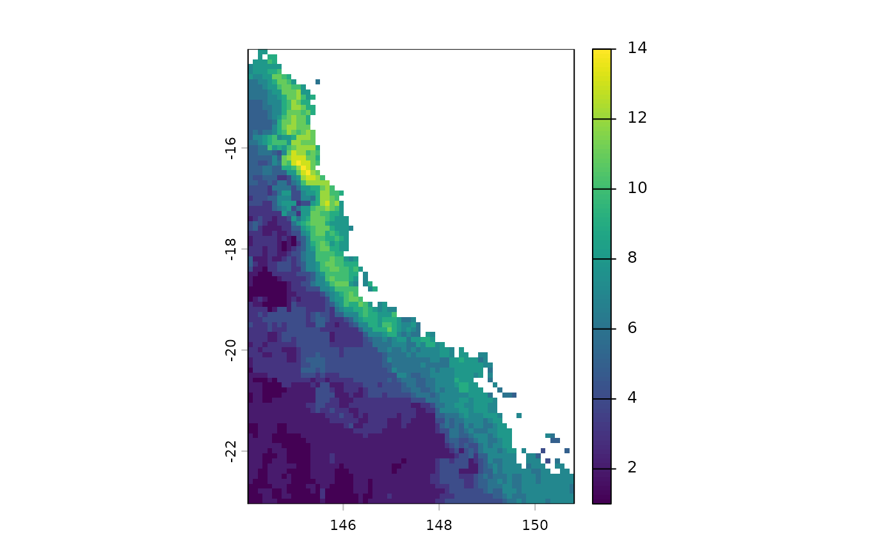

The `delta.grid` function allows you to visualize the variation in these
richness patterns spatially. See an example below.

``` r
dg <- delta.grid(riq.pres, riq.fut)
plot(dg)
```

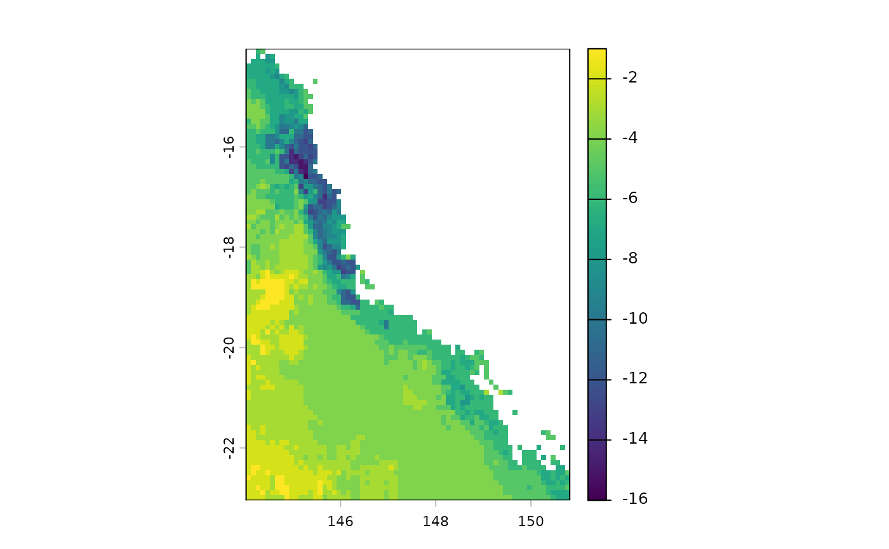

On the map we can see that the greatest loss occurs in the eastern
region of the map, losing up to 16 species. The `delta.grid` function
can be used for any of the other metrics that are available in the
`phyloraster` package.

## Null models

Null models are a widely used method to control for richness effects in
diversity measures (Gotelli and Ulrich, 2012). The standardized effect
size (SES) measure, also known as z-score or z-value, is used to
calculate null models from randomization tests (Gotelli and McCabe
2002). `phyloraster` implements three methods to calculate SES using
spatial and phylogenetic randomization: rast.pe.ses, rast.pd.ses, and
rast.we.ses.

- **Spatial randomization**

The randomization procedure for the calculation of SES is done
internally in the functions
[`rast.we.ses()`](https://gabferreira.github.io/phyloraster/reference/rast.we.ses.md),
[`rast.pd.ses()`](https://gabferreira.github.io/phyloraster/reference/rast.pd.ses.md),
[`rast.ed.ses()`](https://gabferreira.github.io/phyloraster/reference/rast.ed.ses.md),
and
[`rast.pe.ses()`](https://gabferreira.github.io/phyloraster/reference/rast.pe.ses.md)
through the package `SESraster` (Heming et al., 2023). `SESraster`
currently implements six algorithms to randomize binary species
distribution with several levels of constraints: SIM1, SIM2, SIM3, SIM5,
SIM6, and SIM9 (sensu Gotelli, 2000). The methods implemented in the
`SESraster` are based on how species (originally rows) and sites
(originally columns) are treated (i.e. fixed, equiprobable, or
proportional sums) (Gotelli, 2000). The randomization algorithms
currently available in `SESraster` are: SIM1 (species occurrence
equiprobable and site richness equiprobable), SIM2 (species occurrence
fixed and site richness equiprobable), SIM3 (species occurrence
equiprobable and site richness fixed), SIM5 (species occurrence
proportional and site richness fixed), SIM6 (species occurrence
proportional and site richness fixed) and SIM9 (species occurrence fixed
and site richness fixed, similar to the preserved model of Laffan &
Crisp, 2003). In addition, `SESraster` (consequently `phyloraster`)
supports user’s custom randomization algorithms for SES calculation, as
long as the function returns objects of class SpatRaster. This allows
complete flexibility for using any algorithm not yet implemented by the
package.

As default, the `phyloraster` uses the function
[`bootspat_str()`](https://hemingnm.github.io/SESraster/reference/bootspat_str.html)
from the `SESraster` package to conduct the randomizations, but the user
is free to choose any of the other methods mentioned above through the
spat_alg argument in the `*.ses()` functions of the `phyloraster`
package. The function
[`bootspat_str()`](https://hemingnm.github.io/SESraster/reference/bootspat_str.html)
is equivalent to the SIM5 (proportional-fixed) method of Gotelli (2000),
which partially relaxes the spatial structure of species distributions
but keeps the spatial structure of the observed richness pattern across
cells.

Now that we have presented the randomization methods, we can start to
build the null models.

``` r
library(SESraster)
ras <- terra::rast(system.file("extdata", "rast.presab.tif", 
                               package = "phyloraster"))
tree <- ape::read.tree(system.file("extdata", "tree.nex", 
                                   package = "phyloraster"))
dataprep <- phylo.pres(ras, tree, full_tree_metr = TRUE)

t <- rast.pd.ses(dataprep$x, edge.path = dataprep$edge.path, 
                 branch.length = dataprep$branch.length, aleats = 10)
```

Plotting the results

``` r
plot(t)
```

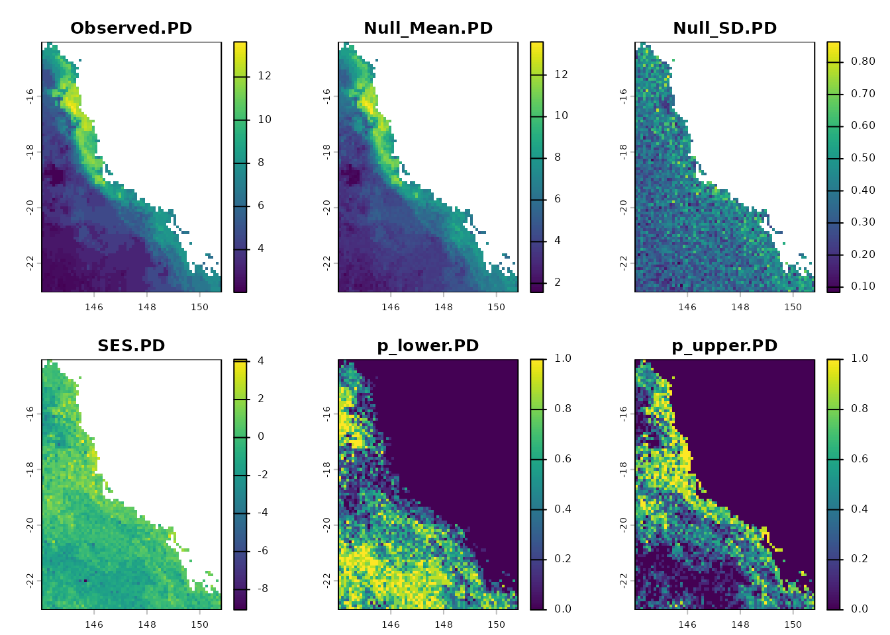

## CANAPE

The package also includes a function to calculate CANAPE (Categorical
Analysis of Neo- and Paleo-Endemism; Mishler et al., 2014). This
function uses the results of
[`rast.pe.ses()`](https://gabferreira.github.io/phyloraster/reference/rast.pe.ses.md)
to identify centers of paleo-, neo-, super-, and mixed-endemism. To
achieve this, the function first calculates a derived metric of
Phylogenetic Endemism (PE) called Relative Phylogenetic Endemism (RPE;
Mishler et al., 2014). RPE is defined as the ratio of PE calculated on
the original phylogenetic tree to PE calculated on an alternate tree
where all branch lengths are transformed to equal length. Next, the
function tests whether the observed values of PE, PE from the alternate
tree, and RPE are significantly higher or lower than expected under a
null model. This null model is run for n iterations (typically 999),
during which PE, PE alternate and RPE are recalculated in each trial,
generating a null distribution for each grid cell. The significance of
the observed values is then assessed using a two-tailed test. For a
given grid cell, an observed value is considered significantly high if
it falls within the top 2.5% of the null distribution and significantly
low if it falls within the bottom 2.5%. Here, we provide an example of
how to calculate the CANAPE.

First, you need to load the data, which will be the same used in the
[`rast.pe()`](https://gabferreira.github.io/phyloraster/reference/rast.pe.md)
function.

``` r
ras <- terra::rast(system.file("extdata", "rast.presab.tif",
                               package="phyloraster"))
tree <- ape::read.tree(system.file("extdata", "tree.nex",
                                   package="phyloraster"))
data <- phylo.pres(ras, tree, full_tree_metr = TRUE)
```

After that, you will be able to calculate the null models for
Phylogenetic Endemism using the function
[`rast.pe.ses()`](https://gabferreira.github.io/phyloraster/reference/rast.pe.ses.md).
Usually, most studies use 999 iterations, but let’s set it to 30
iterations here to reduce processing time. As mentioned earlier, by
default, the `phyloraster` package uses the function
[`bootspat_str()`](https://hemingnm.github.io/SESraster/reference/bootspat_str.html)
from the `SESraster` package to conduct the randomizations in the
`*.ses()` functions. However, users can choose any of the other methods
mentioned above by specifying the spat_alg argument. The user can also
specify the metric argument to calculate significance for specific
metrics: Phylogenetic Endemism (“pe”), Phylogenetic Endemism with the
alternate tree (“pe.alt”), Relative Phylogenetic Endemism (“rpe”), or
all metrics (“all”, the default). The function
[`rast.pe.ses()`](https://gabferreira.github.io/phyloraster/reference/rast.pe.ses.md)
will return a set of metrics and their significance, which will be used
in the CANAPE scheme.

``` r
ses <- rast.pe.ses(x = data$x, tree = data$tree, aleats = 30, metric = "all")
names(ses)
#>  [1] "Observed.PE"      "Null.Mean.PE"     "Null.SD.PE"       "SES.PE"          
#>  [5] "p.lower.PE"       "p.upper.PE"       "Observed.PE.alt"  "Null.Mean.PE.alt"
#>  [9] "Null.SD.PE.alt"   "SES.PE.alt"       "p.lower.PE.alt"   "p.upper.PE.alt"  
#> [13] "Observed.RPE"     "Null.Mean.RPE"    "Null.SD.RPE"      "SES.RPE"         
#> [17] "p.lower.RPE"      "p.upper.RPE"
```

Once the user has calculated the significance for each metric, it’s time
to classify the types of phylogenetic endemism using the function
[`canape.rast()`](https://gabferreira.github.io/phyloraster/reference/canape.rast.md).

``` r
# CANAPE
canape <- canape.rast(ses$p.upper.PE, ses$p.upper.PE.alt,
ses$p.upper.RPE, ses$p.lower.RPE)
terra::plot(canape)
```

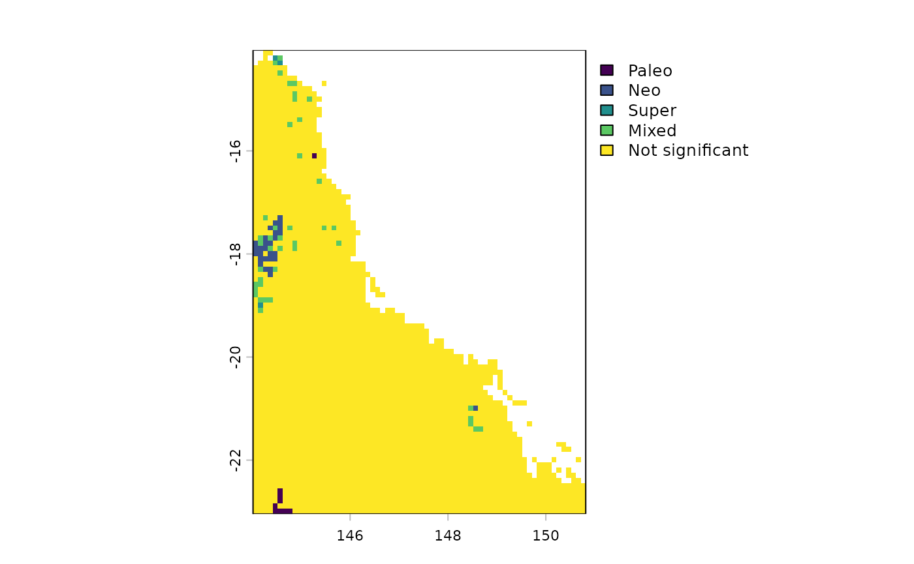

## Citation

Please cite both the package and the article describing the methods in
your publications. Here is an example:

- Article recently published in
  [`Ecography`](https://doi.org/10.1111/ecog.06902): Alves-Ferreira G,
  Mota FMM, Talora DC, Oliveira, C, Solé, MK, Heming NM (2024).
  phyloraster: an R package to calculate measures of endemism and
  evolutionary diversity for rasters. Ecography. doi:
  10.1111/ecog.06902.

- Package published in
  [`CRAN`](https://CRAN.R-project.org/package=phyloraster):
  Alves-Ferreira G, Heming NM, Mota FMM. (2024). phyloraster:
  Evolutionary Diversity Metrics for Raster Data. R package version 2.0.

## References

Crisp, M., Laffan, S., Linder, H. and Monro, A. (2001). Endemism in the
Australian flora. Journal of Biogeography, 28, 183-198.

Daru, B. H., Karunarathne, P., and Schliep, K. (2020). phyloregion: R
package for biogeographical regionalization and macroecology. Methods in
Ecology and Evolution, 11(11), 1483-1491.
<https://doi.org/10.1111/2041-210X.13478>

Faith, D. P. (1992). Conservation evaluation and phylogenetic diversity.
Biological conservation, 61(1), 1-10.

Gotelli, N. J., and McCabe, D. J. (2002). Species co-occurrence: A
meta-analysis of J. M. Diamond’s assembly rules model. Ecology, 83(8),
2091–2096.
<https://doi.org/10.1890/0012-9658(2002)083%5B2091:SCOAMA%5D2.0.CO;2>

Gotelli, N. J., and Ulrich, W. (2012). Statistical challenges in null
model analysis. Oikos, 121(2), 171–180.
<https://doi.org/10.1111/j.1600-0706.2011.20301.x>

Hackathon, R. (2020). phylobase: Base Package for Phylogenetic
Structures and Comparative Data (0.8. 10).
<https://CRAN.R-project.org/package=phylobase>

Hjimans, R. J. (2022). Terra, Spatial Data Analysis (1.6.7).
<https://CRAN.R-project.org/package=terra>

Isaac, N. J., Turvey, S. T., Collen, B., Waterman, C. and Baillie, J. E.
(2007). Mammals on the EDGE: conservation priorities based on threat and
phylogeny. PLoS ONE 2, e296.

Kembel, S. W., Cowan, P. D., Helmus, M. R., Cornwell, W. K., Morlon, H.,
Ackerly, D. D., Blomberg, S. P., and Webb, C. O. (2010). Picante: R
tools for integrating phylogenies and ecology. Bioinformatics, 26(11),
1463–1464. <https://doi.org/10.1093/bioinformatics/btq166>

Paradis, E., and Schliep, K. (2019). ape 5.0: An environment for modern
phylogenetics and evolutionary analyses in R. Bioinformatics, 35,
526–528.

Pearse, W. D., Cadotte, M. W., Cavender-Bares, J., Ives, A. R., Tucker,
C. M., Walker, S. C., & Helmus, M. R. (2015). pez: Phylogenetics for the
environmental sciences. Bioinformatics, 31(17), 2888–2890.
<https://doi.org/10.1093/bioinformatics/btv277>

Rosauer, D. A. N., Laffan, S. W., Crisp, M. D., Donnellan, S. C. and
Cook, L. G. (2009). Phylogenetic endemism: a new approach for
identifying geographical concentrations of evolutionary history.
Molecular ecology, 18(19), 4061-4072.

Williams, P.H., Humphries, C.J., Forey, P.L., Humphries, C.J. and
VaneWright, R.I. (1994). Biodiversity, taxonomic relatedness, and
endemism in conservation. In: Systematics and Conservation Evaluation
(eds Forey PL, Humphries CJ, Vane-Wright RI), p. 438. Oxford University
Press, Oxford.
