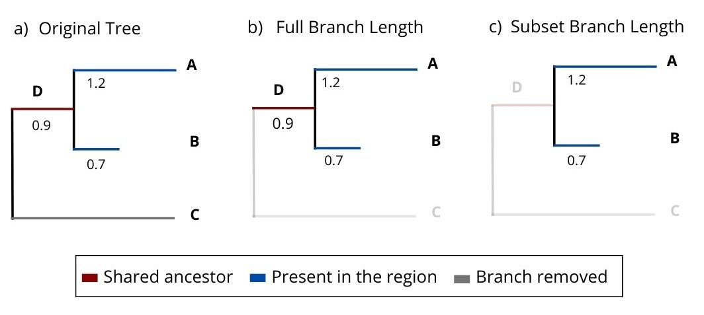

```{r setup, echo = FALSE, include=FALSE}
library(knitr)
knitr::opts_chunk$set(collapse = TRUE,message=FALSE, warning = FALSE,
                      comment = "#>")
```

-   [Introduction](#intro)
-   [Installation](#install)
-   [Data processing](#data)
-   [Analysis](#analysis)
-   [Null Models](#null)
-   [Post Processing](#processing)
-   [References](#references)

## Introduction {#intro}

[`phyloraster`](https://github.com/gabferreira/phyloraster) is an R package to 
calculate measures of endemism and evolutionary diversity using rasters of 
presence-absence as input, allowing to join the results derived from species 
distribution models (SDMs) with phylogenetic information.
A lot of packages such as `phyloregion` (Daru et al., 2020), `picante` 
(Kembel et al., 2010) and `pez` (Pearse et al. 2015) can be used to calculate 
patterns of endemism and evolutionary diversity.
However, most of these packages use matrices that can be computationally 
expensive if the user is working with global or local data with high resolution.
`phyloraster` brings an alternative to these packages by providing functions 
that calculate diversity and endemism metrics for each raster cell, reducing 
the amount of RAM required for data processing.
The functions are focused on the steps of pre-processing, processing and 
post-processing of macroecological and phylogenetic data.

The pre-processing step offers basic functions for preparing the data before 
running the analyses.
The processing step brings together functions to calculate Faith's phylogenetic 
diversity, phylogenetic endemism, weighted endemism and evolutionary 
distinctiveness.
This step also provides functions to calculate standardized effect size for each 
metric through different methods of spatial and phylogenetic randomization, 
aiming to control for richness effects.
The user can applying these methods of randomization to test hypotheses about 
the community structure when richness patterns are correlated with endemism and 
evolutionary patterns (Kembel et al. 2010).
The post processing stage includes functions to calculate the delta of metrics 
between different times (e.g. present and future).
We have shown that the package has a slightly longer computation time than 
comparable packages, but takes up a considerably smaller portion of RAM memory, 
which will allow users to work with high-resolution datasets from local to global 
scales.
This enhances the application of the package by enabling users to work with 
large datasets on computers with less RAM available.
In this vignette, we demonstrate the use of the functions of the `phyloraster` 
package in detail.

## Installation {#install}

The CRAN version of the package can be installed using:
```{r, eval = FALSE}
 install.packages("phyloraster")
```

The development version of `phyloraster` can be downloaded from [GitHub](https://github.com/gabferreira/phyloraster) using the following code:
```{r, eval = FALSE}
devtools::install_github("gabferreira/phyloraster")
```

If you have any questions, let us know through the topic ["Issues"](https://github.com/gabferreira/phyloraster/issues).

`phyloraster` uses some R packages as dependencies such as `terra` 
(version \>= 1.6) (Hijmans, 2022), `ape` (version \>= 5.6) 
(Paradis & Schliep, 2019), and `phylobase` (version \>= 0.810) 
(Hackathon et al. 2020).
Once installed, packages can be loaded into R using `library()`:

```{r, warning = FALSE, message = FALSE}
library(phyloraster)
library(terra)
library(ape)
library(phylobase)

```

## Data processing {#data}

In the step of pre processing, we offer support to manipulate matrices, 
shapefiles, rasters, and phylogenetic trees.
In the processing step, we provide functions to calculate Faith's phylogenetic 
diversity (Faith, 1992), phylogenetic endemism (Rosauer et al., 2009), 
evolutionary distinctiveness (Isaac et al., 2007), and weighted endemism 
(Williams et al., 1994).

-   **Dataset**

The package contains one dataset that allows visualizing the structure expected 
to matrices, rasters, shapefiles and phylogenetic trees and can be accessed 
using the function `load.data.rosauer()`.
This dataset contains a `data.frame` with presence records for 33 Australian 
tree frogs with coordinates for each site (Rosauer 2017) and a phylogenetic tree 
for these species (Rosauer 2017).
This raw dataset can be accessed [here](https://github.com/DanRosauer/phylospatial/tree/master/PhyloEndemism_in_R/Tree%20Frog%20Data).
The function also provide a binary raster of presence absence and a shapefile 
with the range of 27 species following IUCN spatial data.

```{r}
data <- load.data.rosauer()
head(data$presab)
```

```{r}
data$tree
```

```{r, fig.height = 5, fig.width = 5, fig.align = 'center',}
plot(data$tree, cex = 0.65)
```

-   **Function** `df2rast`

The function `df2rast` converts traditional communities matrices (i.e. species 
in columns and sites in rows, with coordinates in the two first columns) into 
binary distribution rasters (presence and absence).

```{r}
data <- load.data.rosauer()
r <- df2rast(x = data$presab, 
             CRS = "+proj=longlat +datum=WGS84 +ellps=WGS84 +towgs84=0,0,0")
class(r)
```

```{r, fig.height = 5, fig.width = 5, fig.align = 'center'}
plot(r)
```

-   **Function** `shp2rast`

The `shp2rast` function transform a shapefile to a raster stack with the same 
extent.
This function allows to work, for example, with the shapes of species distribution 
provided by the [International Union for the Conservation of Nature's Spatial Database](https://www.iucnredlist.org/resources/spatial-data-download).
We provide a set of shapefiles for 27 species of Australian tree frogs.
You can visualize this data through the following code:

```{r}
shp <- terra::vect(system.file("extdata", "shps_iucn_spps_rosauer.shp", 
                               package = "phyloraster"))
```

```{r, fig.height = 5, fig.width = 5, fig.align = 'center'}
colors <- rainbow(length(unique(shp$BINOMIAL)),
                  alpha = 0.5)
position <- match(shp$BINOMIAL,
                  unique(shp$BINOMIAL))
colors <- colors[position]
plot(shp, col = colors, lty = 0,
     main = "Spatial polygons")
library(maps)
maps::map(add = TRUE)
```

```{r, message = F}
r2 <- shp2rast(shp, sps.col = "BINOMIAL", ymask = FALSE, background = 0, 
               resolution = 0.5)
r2
plot(r2[[9]])
```

You can also masking the shapefile using another shapefile, as follows:

```{r, message = F}
library(terra)

shp <- terra::vect(system.file("extdata", "shps_iucn_spps_rosauer.shp",
                              package="phyloraster"))

# create a polygon to use as mask with an extent
e <- terra::ext(113, 123, -43.64, -33.90)
p <- terra::as.polygons(e, crs="")
# cut by the total extension of the polygons
coun.crop <- terra::crop(p, 
                         terra::ext(shp)) 
coun.rast <- terra::rasterize(coun.crop,
terra::rast(terra::ext(shp), resolution = 0.5))

# rasterizing with the mask of the polygon
shp.t <- shp2rast(shp, y = coun.rast, sps.col = "BINOMIAL", ymask = TRUE)
plot(shp.t[[1]], col = c("grey", "green"))
```

-   **Function** `phylo.pres`

To calculate evolutionary measurements it is extremely important that the raster 
with species distributions and the tree have the species names in the same order.
We can verify this premise using a simple logical test like this.

```{r}
data <- load.data.rosauer()
names(data$raster) == data$tree$tip.label
```

The function `phylo.pres` reorder the raster stack according to phylogenetic tree 
order, extract a subtree containing only species present in the raster stack and 
get the branch length for each species.

```{r}
ras <- terra::rast(system.file("extdata", "rast.presab.tif", 
                               package = "phyloraster"))
tree <- ape::read.tree(system.file("extdata", "tree.nex", 
                                   package = "phyloraster"))
dataprep <- phylo.pres(x = ras, tree = tree)
```

Now, the raster stack and the tip label of the tree are in the same order!

```{r}
names(dataprep$x) == tree$tip.label
```

The user also has the option to compute branch length and descendant number 
using the full supplied tree or the tree subsetted by the species present in 
the raster. Notice the implications of using the full or the subsetted tree. 
Consider, for instance, a scenario where a clade comprises four species (A, B, 
C and D - Figure 1a), and the particular area of study involves two of these 
species (A and B, in blue- Figure 1). Furthermore, let's assume that species A 
and B share a branch, denoted as D (in red- Figure 1). Using the full 
phylogenetic tree will estimate the whole length of branches for these two 
species, including the branch shared between them (D), that connects them with 
the ancestor shared with the species absent from that specific region (Figure 
1b). On the other hand, when using the subsetted tree (Figure 1c), branch D 
will be disregarded and only the terminal branches will be used to calculate 
branch length, so that the calculated branch lengths of the species A and B 
will be shorter (Figure 1c). 

```{r, fig.height = 5, fig.width = 7, fig.align = 'center', warning= FALSE, echo = FALSE}

```
Figure 1. Phylogenetic tree for tree frogs denoting the implications of using 
the full or the subsetted tree in the phylo.pres function. Figure a) 
demonstrates the full phylogenetic tree for some tree frog species. In figure 
b), we have the full tree considering species A and B that are present in the 
region (blue), as well as the common ancestor between the two species (red). In 
figure c) we only have the species present in the region.  

## Analysis {#analysis}

Great!!
Now, we are already able to calculate the measures of species richness, endemism 
and evolutionary diversity.

- **Species richness**

Our package allows you to calculate species richness using the `rast.sr` 
function.

```{r, warning= FALSE}
ras <- terra::rast(system.file("extdata", "rast.presab.tif", 
                               package = "phyloraster"))
sr <- rast.sr(x = ras)
sr
```

```{r plot, fig.height = 5, fig.width = 7, fig.align = 'center', warning= FALSE}
plot(sr, main = "Species richness")
```

-   **Endemism measurements**

The `phyloraster` package implements functions for calculating spatial patterns 
of endemism based on the weighted endemism method (WE; Williams et al. 1994, 
Crisp et al. 2001) through the function `rast.we`.
The function returns a raster with the values of weighted endemism by each pixel.
Endemism values range from 0 to 1.

```{r, warning= FALSE}
ras <- terra::rast(system.file("extdata", "rast.presab.tif", 
                               package = "phyloraster"))
wer <- rast.we(x = ras)
wer
```

By using the R plot function from `terra` package it is possible to visualize 
the regions where species with restricted range are distributed.

```{r, fig.height = 5, fig.width = 7, fig.align = 'center', warning= FALSE}
wer$WE
plot(wer$WE, main ="Weigthed Endemism")
```

-   **Evolutionary measurements**

The first evolutionary measure is Faith's phylogenetic diversity (PD, Faith 1994), 
which is calculated as the sum of the branch length for all species occurring 
in a given region (Faith 1994).

```{r pdr, warning= FALSE}
ras <- terra::rast(system.file("extdata", "rast.presab.tif", 
                               package = "phyloraster"))
tree <- ape::read.tree(system.file("extdata", "tree.nex", 
                                   package = "phyloraster"))
dataprep <- phylo.pres(x = ras, tree = tree, pruning = "tree")

pdr <- rast.pd(x = dataprep$x, edge.path = dataprep$edge.path, 
               branch.length = dataprep$branch.length)
```

```{r pdr-plot, fig.height = 5, fig.width = 7, fig.align = 'center', warning= FALSE}
plot(pdr$PD, main = "Phylogenetic diversity")
```

The second measure is phylogenetic endemism (PE, Rosauer et al. 2009), which 
calculates the degree to which PD are restricted to a specific region 
(Rosauer et al. 2009).
The function `rast.pe` returns a raster layer containing PE the region of 
interest.

```{r, warning= FALSE}
ras <- terra::rast(system.file("extdata", "rast.presab.tif", 
                               package = "phyloraster"))
tree <- ape::read.tree(system.file("extdata", "tree.nex", 
                                   package = "phyloraster"))
per <- rast.pe(x = dataprep$x, tree)
per
```

The result can be visualized using the R `plot` function from the `terra` 
package.

```{r per-plot, fig.height = 5, fig.width = 7, fig.align = 'center', warning= FALSE}
plot(per$PE, main = "Phylogenetic Endemism")
```


## Null models {#null}

Null models are a widely used method to control for richness effects in 
diversity measures (Gotelli and Ulrich, 2012).
The standardized effect size (SES) measure, also known as z-score or z-value, 
is used to calculate null models from randomization tests (Gotelli and McCabe 
2002).
`phyloraster` implements three methods to calculate SES using spatial and 
phylogenetic randomization: rast.pe.ses, rast.pd.ses, and rast.we.ses.

-   **Spatial and phylogenetic randomization**

The randomization procedure for the calculation of SES is done internally in the 
functions `rast.we.ses()`, `rast.pd.ses()`, `rast.ed.ses()`, `rast.pe.ses()`, 
and `geo.phylo.ses()` through the package `SESraster` (Heming et al., 2023). 
`SESraster` currently implements six algorithms to randomize binary species 
distribution with several levels of constraints: SIM1, SIM2, SIM3, SIM5, SIM6, 
and SIM9 (sensu Gotelli, 2000). The methods implemented in the `SESraster` are 
based on how species (originally rows) and sites (originally columns) are 
treated (i.e. fixed, equiprobable, or proportional sums) (Gotelli, 2000). The 
randomization algorithms currently available in `SESraster` are: SIM1 (species 
occurrence equiprobable and site richness equiprobable), SIM2 (species 
occurrence fixed and site richness equiprobable), SIM3 (species occurrence 
equiprobable and site richness fixed), SIM5 (species occurrence proportional 
and site richness fixed), SIM6 (species occurrence proportional and site 
richness fixed) and SIM9 (species occurrence fixed and site richness fixed, 
similar to the preserved model of Laffan & Crisp, 2003). In addition, 
`SESraster` (consequently `phyloraster`) supports user’s custom randomization 
algorithms for SES calculation, as long as the function returns objects of 
class SpatRaster. This allows complete flexibility for using any algorithm not 
yet implemented by the package.

As default, the `phyloraster` uses the function `bootspat_str()` from the 
`SESraster` package to conduct the randomizations, but the user is free to 
choose any of the other methods mentioned above through the spat_alg argument 
in the `*.ses()` functions of the `phyloraster` package. The function 
`bootspat_str()` is equivalent to the SIM5 (proportional-fixed) method of 
Gotelli (2000), which partially relaxes the spatial structure of species 
distributions but keeps the spatial structure of the observed richness pattern 
across cells.

Now that we have presented the randomization methods, we can start to build the 
null models.

```{r}
library(SESraster)
ras <- terra::rast(system.file("extdata", "rast.presab.tif", 
                               package = "phyloraster"))
tree <- ape::read.tree(system.file("extdata", "tree.nex", 
                                   package = "phyloraster"))
data <- phylo.pres(ras, tree, pruning = "tree")

t <- rast.pd.ses(data$x, edge.path = data$edge.path, 
                 branch.length = data$branch.length, aleats = 10, 
                 random = "spat")
```

Plotting the results

```{r pds-plot, fig.height = 5, fig.width = 7, fig.align = 'center', warning= FALSE}
plot(t)
```

## Post processing {#processing}

-   **Function** `delta.grid`

The package also brings the function `delta.grid` that allows you to calculate 
the difference between spatialized diversity metrics between two different times.
This function would allow assessing how species richness varies between 
different times, which could be useful in a climate change scenario.
For example, imagine that we currently have 33 tree frog species of the 
subfamily Pelodryadinae occurring in Australia.
In the map below we can visualize the spatial pattern of species richness.

```{r sr-plot}
# load the data
x <- terra::rast(system.file("extdata", "rast.presab.tif", 
                             package="phyloraster"))
# richness
riq.pres <- rast.sr(x)
plot(riq.pres)
```

Now imagine that as climate change progresses, 16 relatively more vulnerable 
species are heavily affected and become locally extinct.

```{r srf-plot}
# load the data
x <- terra::rast(system.file("extdata", "rast.presab.tif", 
                             package="phyloraster"))
# richness future
riq.fut <- rast.sr(x[[c(1:15)]]) # imagine we lost some species in the future
terra::plot(riq.fut)
```

The `delta.grid` function allows you to visualize the variation in these 
richness patterns spatially.
See an example below.

```{r dg}
dg <- delta.grid(riq.pres, riq.fut)
plot(dg)
```

On the map we can see that the greatest loss occurs in the eastern region of 
the map, losing up to 16 species.
The `delta.grid` function can be used for any of the other metrics that are 
available in the `phyloraster` package.

## References {#references}

Crisp, M., Laffan, S., Linder, H. and Monro, A.
(2001).
Endemism in the Australian flora.
Journal of Biogeography, 28, 183--198.

Daru, B. H., Karunarathne, P., and Schliep, K.
(2020).
phyloregion: R package for biogeographical regionalization and macroecology.
Methods in Ecology and Evolution, 11(11), 1483--1491.
<https://doi.org/10.1111/2041-210X.13478>

Faith, D. P. (1992).
Conservation evaluation and phylogenetic diversity.
Biological conservation, 61(1), 1-10.

Gotelli, N. J., and McCabe, D. J.
(2002).
Species co-occurrence: A meta-analysis of J.
M. Diamond's assembly rules model.
Ecology, 83(8), 2091--2096.
[https://doi.org/10.1890/0012-9658(2002)083[2091:SCOAMA]2.0.CO;2](https://doi.org/10.1890/0012-9658(2002)083%5B2091:SCOAMA%5D2.0.CO;2){.uri}

Gotelli, N. J., and Ulrich, W.
(2012).
Statistical challenges in null model analysis.
Oikos, 121(2), 171--180.
<https://doi.org/10.1111/j.1600-0706.2011.20301.x>

Hackathon, R.
(2020).
phylobase: Base Package for Phylogenetic Structures and Comparative Data (0.8. 10).
<https://CRAN.R-project.org/package=phylobase>

Hjimans, R. J.
(2022).
Terra, Spatial Data Analysis (1.6.7).
<https://CRAN.R-project.org/package=terra>

Isaac, N. J., Turvey, S. T., Collen, B., Waterman, C.
and Baillie, J. E.
(2007).
Mammals on the EDGE: conservation priorities based on threat and phylogeny.
PLoS ONE 2, e296.

Kembel, S. W., Cowan, P. D., Helmus, M. R., Cornwell, W. K., Morlon, H., Ackerly, D. D., Blomberg, S. P., and Webb, C. O.
(2010).
Picante: R tools for integrating phylogenies and ecology.
Bioinformatics, 26(11), 1463--1464.
<https://doi.org/10.1093/bioinformatics/btq166>

Paradis, E., and Schliep, K.
(2019).
ape 5.0: An environment for modern phylogenetics and evolutionary analyses in R.
Bioinformatics, 35, 526--528.

Pearse, W. D., Cadotte, M. W., Cavender-Bares, J., Ives, A. R., Tucker, C. M., Walker, S. C., & Helmus, M. R.
(2015).
pez: Phylogenetics for the environmental sciences.
Bioinformatics, 31(17), 2888--2890.
<https://doi.org/10.1093/bioinformatics/btv277>

Rosauer, D. A. N., Laffan, S. W., Crisp, M. D., Donnellan, S. C.
and Cook, L. G.
(2009).
Phylogenetic endemism: a new approach for identifying geographical concentrations of evolutionary history.
Molecular ecology, 18(19), 4061-4072.

Williams, P.H., Humphries, C.J., Forey, P.L., Humphries, C.J.
and VaneWright, R.I.
(1994).
Biodiversity, taxonomic relatedness, and endemism in conservation.
In: Systematics and Conservation Evaluation (eds Forey PL, Humphries CJ, Vane-Wright RI), p. 438.
Oxford University Press, Oxford.
